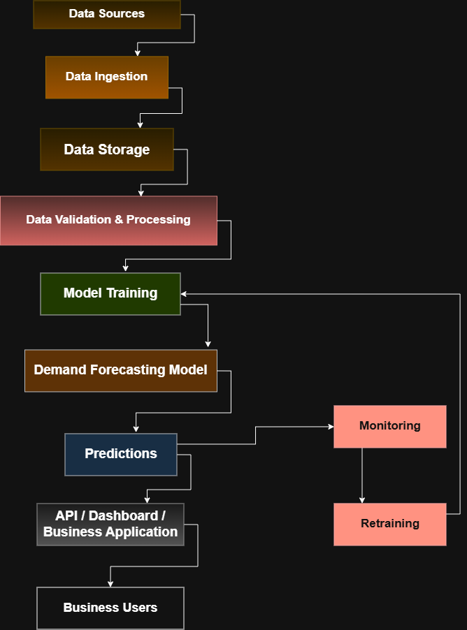

# Retail Demand Forecasting Platform

## Project Overview

The Retail Demand Forecasting Platform is a production-oriented AI and machine learning project designed to help a retail business predict future product demand across multiple stores.

Retail businesses can face two common inventory problems:

- Overstocking, where too much inventory is purchased or stored
- Stockouts, where products become unavailable when customers want to buy them

The goal of this project is to build a system that can use historical business data to estimate future demand and support better inventory, purchasing, and stocking decisions.

This project is being developed gradually through structured engineering sprints.

## Business Problem

The retail company operates multiple stores and sells many products.

Management needs better visibility into future demand so that inventory and supply chain teams can make more informed decisions about:

- How much stock to order
- Which products need replenishment
- Which stores may require additional stock
- Which products may be at risk of stockout
- Which products may be overstocked

The forecasting system is intended to support these decisions by providing future demand estimates.

## Current Scope

The project is currently in the project initiation and system design stage.

Sprint 001 focuses on understanding the business problem and defining how the project should begin.

The current scope includes:

- Business problem understanding
- Client discovery questions
- Initial data requirements
- Data quality considerations
- High-level system architecture
- Initial GitHub repository structure
- One-week development plan

Machine learning model development, API development, and deployment are not part of Sprint 001.

## Assumptions

At this stage, the following assumptions are being made:

- Historical sales data will be available
- Product and store information will be available
- Dates and transaction history will be available
- The company wants to reduce both stockouts and overstocking
- Forecasts may eventually be required at product and store level
- The final forecast frequency may be daily, weekly, or monthly
- Data quality issues may need to be handled before model development
- The final solution may eventually be accessed through an API, dashboard, or business application

These assumptions will need to be confirmed with the client.

## Proposed Technology Stack

The following technologies are currently being considered for the project:

- **Python** - main programming language for data processing and machine learning
- **Pandas** - working with and analysing tabular data
- **Scikit-learn / forecasting libraries** - initial model development and evaluation
- **FastAPI** - possible API layer for exposing predictions to other applications
- **Git** - version control for tracking project changes
- **GitHub** - repository hosting, documentation, and project collaboration
- **draw.io / diagrams.net** - architecture and system diagrams

The technology stack may change after the client's technical environment and deployment requirements are confirmed.

## High-Level Architecture

The proposed high-level architecture shows the expected journey of data through the forecasting platform:

1. Data sources
2. Data ingestion
3. Data storage
4. Data validation and processing
5. Model training
6. Demand forecasting model
7. Predictions
8. API, dashboard, or business application
9. Business users
10. Monitoring and retraining



## Repository Structure

```text
retail-demand-forecasting-platform/
│
├── README.md
├── .gitignore
│
└── docs/
    ├── problem-understanding.md
    ├── client-questions.md
    ├── data-requirements.md
    ├── architecture.png
    └── week-1-plan.md
